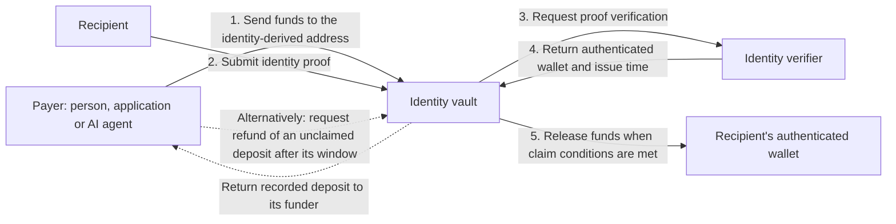

# P2ID protocol specification

P2ID's goal is to let people, applications and AI agents send onchain payments using a
recipient's known identity, such as an email address, social handle or phone number, without
first asking for a wallet address.

For example, an agent could pay a contributor by their GitHub username, an application could
send a reward to a social handle, or a customer could pay an invoice addressed to an email.
These payments use an address derived from the recipient's identity. The recipient does not
need to register with P2ID before someone derives that address or sends funds to it.

Funds are held in an identity-specific vault. To receive them in a wallet, the recipient
provides a proof accepted by the applicable identity verifier. The verifier authenticates
the association between the identity and the wallet, and the vault releases the funds to
that wallet, subject to the claim rules described below.

Payments made through the vault's funding functions create recorded deposits with a refund
window. If a deposit remains unclaimed after that window, its funder can request a refund
to recover the funds. Refunds are not automatic; the recipient can still claim until the
deposit is refunded. Direct transfers to the vault address do not provide a refund right.

Pvium's reference verifier, `PviumVerifier`, uses zero-knowledge proofs to verify that an
identity-provider-signed token links the recipient's identity to an EVM wallet. Verification
does not disclose the token or identity value onchain; the payout wallet address is public.



## Conformance

The terms **MUST**, **MUST NOT**, and **MAY** are normative.

P2ID defines an identity commitment, a deterministic vault-address calculation, URI syntax,
and the `p2id.vault.v1` and `p2id.factory.v1` contract interfaces. A deployment selects its
own factory address and vault creation-code hash. A verifier selects its own proof format and
trusted identity sources.

## Identity commitments

An identity is the pair `(typeId, value)`. Its commitment is:

```text
normalizedValue = normalize(typeId, value)
identityHash    = SHA-256("p2id.identity.v1" || byte(typeId) || normalizedValue)
```

`||` denotes byte concatenation. `"p2id.identity.v1"` is its 16-byte ASCII encoding.
`typeId` is encoded as one byte. `normalizedValue` is UTF-8 encoded without ABI padding,
separators, or a length prefix.

### Normalization

- A value MUST contain from 1 through 128 UTF-8 bytes.
- For every type except `phone` and non-EVM `wallet`, ASCII `A` through `Z` MUST be replaced
  with `a` through `z` before hashing.
- Normalization MUST NOT trim whitespace or perform Unicode case folding.
- `phone` values MUST use E.164 form, including the leading `+`.
- Handle values MUST omit a leading `@`.
- An EVM `wallet` value MUST be a `0x`-prefixed hexadecimal address. It is ASCII-lowercased
  before hashing. A wallet value without `0x` is not lowercased.

### Identity types

| Id | Type | Value | Normalized |
| --: | --- | --- | :---: |
| 0 | `email` | email address | ASCII lowercase |
| 1 | `phone` | E.164 phone number | unchanged |
| 2 | `google` | Google account email | ASCII lowercase |
| 3 | `x` | X handle | ASCII lowercase |
| 4 | `discord` | Discord username | ASCII lowercase |
| 5 | `github` | GitHub username | ASCII lowercase |
| 6 | `linkedin` | LinkedIn account email | ASCII lowercase |
| 7 | `apple` | Apple ID email | ASCII lowercase |
| 8 | `telegram` | Telegram username | ASCII lowercase |
| 9 | `tiktok` | TikTok username | ASCII lowercase |
| 10 | `instagram` | Instagram username | ASCII lowercase |
| 11 | `farcaster` | Farcaster username | ASCII lowercase |
| 12 | `wallet` | EVM or other wallet identifier | see normalization |

The type table is append-only. A new type MUST receive an unused identifier. An existing
identifier MUST NOT be reassigned or reused.

## Vault address

For a factory address and vault creation-code hash, the P2ID vault address is:

```text
p2idAddress = last20(Keccak-256(0xff || factory || identityHash || vaultInitCodeHash))
```

`factory` is a 20-byte EVM address. `vaultInitCodeHash` is the 32-byte Keccak-256 hash of the
vault creation bytecode. `identityHash` is the CREATE2 salt. The resulting address MUST be
presented with an EIP-55 checksum.

A vault implementation MUST use the same `identityHash` for its CREATE2 salt and for the
identity commitment submitted to a verifier.

### Address vector

```text
typeId          = 0
value           = "Test-9988@Privy.io"
normalizedValue = "test-9988@privy.io"

identityHash = 0xbcda0f09fa9732b2bfdea38199486b654a84e8e06085d7e364af8137f8d7deaf
factory      = 0x1111111111111111111111111111111111111111
vaultInitCodeHash = 0x96258fa4d7b91381fe24eb208a7a314d37df30bc6bd636479fa2f174c822f371
p2idAddress  = 0x2efaF3C88CcB593AF0b8515b3f5F793a934Ff881
```

## Contract versions

A P2ID vault MUST expose:

```solidity
function p2idVersion() external pure returns (string memory);
```

`p2idVersion()` on a vault implementing this specification MUST return `"p2id.vault.v1"`.

A P2ID factory MUST expose the same function. `p2idVersion()` on a factory implementing this
specification MUST return `"p2id.factory.v1"`.

These values identify contract-interface versions. They do not identify a particular factory,
vault bytecode hash, chain, or deployment.

## P2ID URIs

A P2ID URI identifies an identity:

```text
p2id:<type>:<value>[?<parameter>=<value>&...]
```

`type` MUST be a lowercase type name from the identity-type table. `value` extends from the
second `:` to `?` or the end of the URI. It MUST be percent-decoded before normalization and
hashing. Literal `%`, `?`, `#`, and spaces in a value MUST be percent-encoded.

The following parameters are defined when present:

| Parameter | Meaning |
| --- | --- |
| `amount` | Decimal amount in token units. |
| `token` | `native`, a token symbol, or an ERC-20 address. |
| `chain` | EIP-155 chain identifier. |
| `constraint` | `bytes32` commitment supplied when funding. |
| `verifier` | Verifier address selected when funding. |
| `window` | Refund window in seconds. |
| `ref` | Application-defined reference for the funding event. |
| `memo` | Application-defined text. |
| `claim` | `<chainId>:<depositId>` for a recorded deposit. |

Consumers MUST ignore parameters they do not recognize. A URI without `amount` or `claim`
identifies an identity. A URI with `amount` is a payment request. A URI with `claim` identifies
a recorded deposit.

## Verification and claims

A P2ID verifier MUST implement [`IP2IDVerifier`](contracts/src/interfaces/IP2IDVerifier.sol):

```solidity
function getIdentityWallet(
    bytes32 identityHash,
    bytes calldata proof,
    Constraint calldata constraint
) external view returns (address wallet, uint64 iat);

function supportsConstraints() external view returns (bool);
```

For a successful verification, `getIdentityWallet` MUST authenticate the supplied
`identityHash`, return a nonzero wallet address, and return the attestation issue time as Unix
seconds. It MUST revert when the proof is invalid, the proof authenticates a different identity,
or a nonzero constraint is not satisfied.

The vault MUST supply its own identity commitment to the verifier. It MUST use the wallet
returned by the verifier as the payout address and MUST NOT accept a caller-provided replacement
payout address.

A vault MUST reject a proof whose issue time is earlier than the latest accepted issue time for
that verifier and identity. A proof with the same issue time MUST NOT replace a previously
recorded payout wallet.

## Funding and refunds

Native currency is represented by `address(0)`. A native-currency funding call MUST provide an
amount equal to `msg.value`.

A direct native-currency transfer or ERC-20 transfer to a vault creates no deposit record and
no refund right. It is claimed through the factory's default verifier.

`fund()` creates a recorded deposit under the factory's default verifier. `fundWith()` creates a
recorded deposit under the specified verifier. A recorded deposit MUST retain its funder, token,
amount, verifier, constraint, refund window, and fee terms.

A nonzero constraint MAY be used only with a verifier that supports constraints. The verifier
MUST validate the constraint before the vault releases the associated deposit.

All funding methods take a final `bytes32 ref` value. The vault MUST emit this value as the final
field of `Funded`. The vault MUST NOT use `ref` to determine eligibility, fees, refunds, or the
payout recipient. `ref` MAY be reused.

After `fundedAt + refundWindow`, the recorded funder MAY refund an unconsumed deposit. The vault
MUST return the refunded amount to that funder and MUST NOT charge a claim fee. Eligibility for a
refund does not prevent a claim until the refund is completed.

## Reference implementation

Pvium provides `PviumP2IdVaultFactory`, `P2IDVault`, and `PviumVerifier` as an implementation of
these interfaces. `PviumVerifier` verifies zero-knowledge proofs over identity-provider-signed
tokens. Its proving system, trusted keys, policy configuration, and deployment addresses are
implementation-specific.
