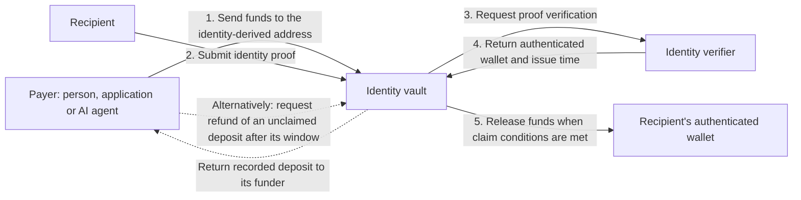

# P2ID protocol specification

P2ID's goal is to let people, applications and AI agents send onchain payments using a
recipient's known identity, such as an email address, social handle or phone number, without
first asking for a wallet address.

For example, an agent could pay a contributor by their GitHub username, an application could
send a reward to a social handle, or a customer could pay an invoice addressed to an email.
These payments use an address derived from the recipient's identity. The recipient does not
need to register with P2ID before someone derives that address or sends funds to it.

Funds are held in an identity-specific vault. To receive them in a wallet, the recipient
provides a proof accepted by the applicable identity verifier. The verifier authenticates
the association between the identity and the wallet, and the vault releases the funds to
that wallet, subject to the claim rules described below.

Payments made through the vault's funding functions create recorded deposits with a refund
window. If a deposit remains unclaimed after that window, its funder can request a refund
to recover the funds. Refunds are not automatic; the recipient can still claim until the
deposit is refunded. Direct transfers to the vault address do not provide a refund right.

Pvium's reference verifier, `PviumVerifier`, uses zero-knowledge proofs to verify that an
identity-provider-signed token links the recipient's identity to an EVM wallet. Verification
does not disclose the token or identity value onchain; the payout wallet address is public.



At the protocol level, P2ID maps an identity type and value to a deterministic EVM vault
address using a factory address and vault creation bytecode hash. Vaults support native
currency and ERC-20 tokens; a vault can receive funds before it is deployed, but must be
deployed before those funds can be claimed.

This specification defines identity encoding, vault address derivation, address scheme
versioning, URI syntax, claim processing and the verifier and policy interfaces.

## Identity verification scope

P2ID specifies the verification interface and the conditions for accepting its result. Each
verifier defines its proof format, trusted identity sources and verification procedure. A
verifier MUST authenticate the association between the requested identity commitment and a
nonzero wallet address, return the underlying attestation's issue time, and reject invalid
proofs or unsatisfied funding constraints. Implementing `IP2IDVerifier` alone does not grant
eligibility to process claims; eligibility is governed by the factory and policy rules below.

`PviumVerifier` is the reference verifier. It verifies a zero-knowledge proof that a signed
identity-provider token contains the identity and an associated EVM wallet. Its proof format
and trusted signing keys belong to that implementation; they are not requirements for other
P2ID verifiers.

## Requirement language

MUST and MUST NOT indicate requirements for conformance to this specification. MAY indicates
permitted optional behaviour. Descriptions explicitly attributed to Pvium or an SDK describe
those implementations.

## Address derivation

```
v            = lowercase(value)   unless the type is phone, or the type is wallet and the
                                  value does not start with "0x" (then v = value)

identityHash = SHA-256( "p2id.identity.v1" ‖ byte(typeId) ‖ v )

p2id         = last 20 bytes of Keccak-256( 0xff ‖ factory ‖ identityHash ‖ vaultInitCodeHash )
```

| Symbol               | Meaning                                                        | Size        |
| -------------------- | -------------------------------------------------------------- | ----------- |
| `"p2id.identity.v1"` | ASCII domain prefix                                            | 16 bytes    |
| `typeId`             | identity type id, see the table below                          | 1 byte      |
| `value`              | the identity as UTF-8; lowercasing is ASCII only (`A`–`Z`)     | 1–128 bytes |
| `factory`            | the vault factory address for the scheme and environment       | 20 bytes    |
| `vaultInitCodeHash`  | Keccak-256 of the `P2IDVault` creation bytecode                | 32 bytes    |

`‖` denotes byte concatenation. The address formula uses CREATE2 with `identityHash` as the
salt and is independent of whether the vault has been deployed. Addresses are displayed with
an EIP-55 checksum.

The vault stores `identityHash` as its identity commitment and passes it to the verifier on
each proof submission. The verifier MUST reject a proof that does not authenticate that
commitment.

### Schemes and versions

Identity hashing and vault addressing use independently versioned domains:

| Domain             | Versions                                             | Changes when                                 |
| ------------------ | ---------------------------------------------------- | -------------------------------------------- |
| `p2id.identity.vN` | the identity hash: prefix, type table, normalisation | existing identity commitments would change |
| `p2id.vault.vN`    | the address: `factory` and `vaultInitCodeHash`       | the vault bytecode or the factory changes    |

Each address scheme MUST specify its identity domain. A change to vault bytecode does not
require a change to identity hashing. Existing proofs remain usable only with verifiers that
accept their proof format and identity domain. In the reference deployment, the scheme domain
also determines the factory's namespace and deployment salt: `keccak256(schemeDomain)`.

The constants of every scheme are in [`sdks/node/p2id-core/src/p2id.json`](sdks/node/p2id-core/src/p2id.json), keyed
by domain. Once a factory is recorded, the scheme's identity domain, bytecode hash and recorded
factory addresses MUST NOT change. The reference build rejects vault bytecode that does not
match its recorded hash. Changes to those constants require a new scheme entry and an update
to `current`. Older entries MUST remain available for address derivation under their original
schemes. Claim eligibility remains subject to the deployed contracts' verifier and policy rules.

The current scheme, `p2id.vault.v2`, adds the `ref` funding argument and event field. The
`p2id.vault.v1` entry remains available for deriving
existing addresses; its funding methods and `Funded` event do not include `ref`.

### Example

The following vector uses the `p2id.vault.v2` bytecode hash and an illustrative factory address.

```
type  = email (0)
value = "Test-9988@Privy.io"          →  v = "test-9988@privy.io"

identityHash = SHA-256( "p2id.identity.v1" ‖ 0x00 ‖ "test-9988@privy.io" )
             = 0xbcda0f09fa9732b2bfdea38199486b654a84e8e06085d7e364af8137f8d7deaf

factory           = 0x1111111111111111111111111111111111111111      (illustrative)
vaultInitCodeHash = 0x5d4eab8fb0d7ca20e288e2953f8029d9caca9d58cc098f67b8f88d9723328c1e
p2id              = 0x892b8f40737C601C86e714c451492909f2ad1D1D
```

The identity-hash preimage is 35 bytes:

```
70 32 69 64 2e 69 64 65 6e 74 69 74 79 2e 76 31          "p2id.identity.v1"     16 bytes
00                                                       typeId 0 (email)        1 byte
74 65 73 74 2d 39 39 38 38 40 70 72 69 76 79 2e 69 6f    "test-9988@privy.io"   18 bytes
```

`typeId` is encoded as one raw byte: `0x00` for `email`, `0x05` for `github` and `0x0c` for
wallet. The preimage contains no ABI padding, separators or length prefixes. In Solidity,
with `v` already normalised:

```solidity
sha256(abi.encodePacked("p2id.identity.v1", uint8(typeId), v))
```

With the SDK:

```ts
import { p2idAddress } from '@pvium/p2id-core';
const to = p2idAddress({
  identityType: 'email',
  identityValue: 'you@example.com',
});
```

## Identity types

An identity is the pair `(type, value)`. The type identifier is part of the hash preimage;
GitHub `octocat` and TikTok `octocat` therefore have different preimages even though their
values are identical.

|  Id | Type        | Value                              | Example value                      | Lowercased |
| --: | ----------- | ---------------------------------- | ---------------------------------- | :--------: |
|   0 | `email`     | email address                      | `you@example.com`                  |    yes     |
|   1 | `phone`     | phone number, E.164                | `+15551234567`                     |     no     |
|   2 | `google`    | Google account email               | `you@gmail.com`                    |    yes     |
|   3 | `x`         | X (Twitter) handle                 | `jack`                             |    yes     |
|   4 | `discord`   | Discord username                   | `wumpus`                           |    yes     |
|   5 | `github`    | GitHub username                    | `octocat`                          |    yes     |
|   6 | `linkedin`  | LinkedIn account email             | `you@example.com`                  |    yes     |
|   7 | `apple`     | Apple ID email                     | `you@icloud.com`                   |    yes     |
|   8 | `telegram`  | Telegram username                  | `durov`                            |    yes     |
|   9 | `tiktok`    | TikTok username                    | `charlidamelio`                    |    yes     |
|  10 | `instagram` | Instagram username                 | `instagram`                        |    yes     |
|  11 | `farcaster` | Farcaster username                 | `dwr`                              |    yes     |
|  12 | `wallet`    | wallet address                     | `0xA01b…0f98`, or a base58 address | only `0x…` |

Value encoding requirements:

- Values MUST contain 1–128 bytes when UTF-8 encoded. ASCII lowercasing replaces only `A`–`Z`
  with `a`–`z`; it does not perform Unicode case folding or trim whitespace.
- Handles MUST omit the leading `@`. Phone numbers MUST use E.164 form, including the `+`.
- The same email under `email`, `google`, `linkedin` and `apple` represents four distinct
  identities. The payer MUST select the intended type.
- EVM wallet addresses MUST use a `0x`-prefixed hexadecimal string, which is ASCII-lowercased
  before hashing. Wallet values without that prefix, including base58 addresses, are hashed
  without case conversion.

### Type identifiers

Numeric identifiers keep commitments stable when platform names or SDK aliases change.
SDKs MUST map supported names to identifiers before hashing. The type identifier occupies
exactly one byte in the preimage.

The type table is **append-only**. New types MUST receive the next unused identifier; existing
identifiers MUST NOT be reassigned or reused, including those of discontinued platforms. A verifier maps
its identity provider's account kinds onto these types; the Pvium verifier's mapping from Privy
`linked_accounts[].type` is `email`, `phone`, `google_oauth`, `twitter_oauth`, `discord_oauth`,
`github_oauth`, `linkedin_oauth`, `apple_oauth`, `telegram`, `tiktok_oauth`, `instagram_oauth`,
`farcaster`, `wallet`, in id order. The table is defined in
[`circuit/src/identity.nr`](circuit/src/identity.nr) and mirrored in
[`contracts/src/lib/P2IDHash.sol`](contracts/src/lib/P2IDHash.sol),
[`sdks/node/p2id-core/src/identity.ts`](sdks/node/p2id-core/src/identity.ts) and
[`http-prover/src/identity.ts`](http-prover/src/identity.ts).

## Chains and environments

Address derivation contains no chain identifier. The reference factory uses the deterministic deployment
proxy (`contracts/scripts/deploy-deterministic.ts`) with the scheme's deployment salt. Within
one scheme and environment, identical factory addresses and vault bytecode produce identical
vault addresses across supported chains. Chains with different CREATE2 semantics are outside
the scope of this specification.

A vault MUST be deployed on the chain holding the funds before those funds can be claimed.
`factory.deploy(identityHash)` is permissionless. Native currency and ERC-20 balances at the
derived address are held at that same address after deployment.

A deployment MAY define environments, each with its own factory configuration. Pvium defines
`production` for mainnets and `sandbox` for testnets, with a separate identity-provider app for
each environment. Address derivation requires a configured factory address for the selected
scheme and environment. The Node SDK defaults to `production`.

## P2ID URIs

A P2ID URI identifies an identity and optionally includes payment or claim parameters:

```
p2id:<type>:<value>[?<parameters>]
```

`type` is the identity type's URI name from the table above; `value` is the identity value. The
value starts after the first `:` following the type and runs to the `?` or the end. Literal
`?`, `#`, `%` and spaces in the value MUST be percent-encoded; `@`, `+`, `.` and `/` may appear
unencoded. The URI has no authority component and MUST NOT include `//` after `p2id:`.
The optional `chain` parameter selects the payment chain. Address derivation on that chain
still requires the factory and bytecode hash for the selected scheme and environment.

```
p2id:email:feminefa@example.com
p2id:x:jack
p2id:phone:+15551234567
p2id:email:feminefa@example.com?amount=25&token=USDC&chain=56&ref=inv-42
```

The canonical form MUST use the lowercase type name from the table and the value normalised
according to the address derivation rules. The value MUST be percent-decoded before hashing.
The type and decoded value determine `identityHash`; deriving a vault address additionally
requires the scheme and environment configuration. This specification defines no reverse
mapping from a hash or vault address to an identity. The Node SDK also accepts `twitter` as
an alias of `x` and recognises provider-specific names.

Parameters, all optional, follow `?` as `key=value` pairs separated by `&`:

| Parameter    | Meaning                                                                                       |
| ------------ | --------------------------------------------------------------------------------------------- |
| `amount`     | Decimal amount in token units (`25`, `0.5`), never in base units                              |
| `token`      | `native`, a symbol (`USDC`, needs `chain`) or a token contract address                        |
| `chain`      | EIP-155 chain id. Absent: the payer chooses among the supported chains                        |
| `constraint` | The `bytes32` commitment passed to `fund()`; its interpretation and evidence format are defined by the selected verifier |
| `verifier`   | Verifier address for `fundWith()`. Absent: the factory's default                              |
| `window`     | Refund window in seconds                                                                      |
| `ref`        | Application reference, such as an invoice id; the application defines its encoding or hash for the funding method's `bytes32 ref` |
| `memo`       | Text shown to the payer or payee                                                              |
| `claim`      | `<chainId>:<depositId>`: the URI is a claim link for that deposit                             |

Without `amount` or `claim` the URI names an identity, for example an explorer profile. With
`amount` it is a payment request; with `claim` it is a claim link. Consumers MUST ignore unknown
parameters.

The `https` form replaces `p2id:` with the explorer origin and the first `:` with `/`:

```
https://p2id.xyz/email/feminefa@example.com?amount=25&token=USDC&chain=56
```

Conversion between these forms MUST preserve the identity and query parameters, applying the
encoding required by each form. The explorer origin identifies the web application handling
the link. Opening a link in an installed application depends on that application's URI-handler
registration and the user's device configuration.

## Claims and policy

### Verifier interface

Verifiers MUST implement [`IP2IDVerifier`](contracts/src/interfaces/IP2IDVerifier.sol):

```solidity
function getIdentityWallet(
    bytes32 identityHash,
    bytes calldata proof,
    Constraint calldata constraint
) external view returns (address wallet, uint64 iat);

function supportsConstraints() external view returns (bool);
```

`Constraint` contains a `bytes32 commitment` and `bytes signature`. The latter carries
verifier-specific evidence. A zero commitment means no funding constraint.

For each proof submission, the vault supplies its stored identity commitment, the proof and
the applicable constraint. The verifier MUST revert if the proof is invalid, authenticates a
different identity commitment or fails to satisfy a nonzero constraint. On success, it MUST
return the authenticated wallet address and the attestation's issue time in Unix seconds.
The wallet MUST NOT be `address(0)`.

The vault relies on the selected verifier to authenticate this result. The claim caller
cannot supply a replacement payout address. Unconstrained sweeps pay the wallet recorded
from an accepted proof; constrained claims pay the wallet returned for that claim's proof.

In the reference implementation, `PviumVerifier` accepts a zero-knowledge proof over a Privy
token signed by a registered key. The proof authenticates the linked identity and EVM wallet
without disclosing the token or identity value; the wallet address is public. A nonzero
constraint requires a registered constraint signer's EIP-712 signature over the commitment
in that verifier's domain.

### Proof freshness

The vault records a wallet and the latest accepted issue time for each verifier. A proof
with an earlier issue time MUST be rejected. The first accepted proof initialises the
record; a proof with a later issue time updates it. An equal issue time does not replace the
recorded wallet. `refreshProof` submits a proof without claiming funds.

For direct transfers, the vault also records the highest issue time accepted through a
verifier while it was the factory default. This value persists across default-verifier
changes. Direct transfers can be paid only when the current default verifier's recorded
proof is at least as recent as that value.

### Funding and refunds

Direct transfers of native currency or ERC-20 tokens create no deposit record and confer no
refund right. They are claimed through the factory's current default verifier. Vault
functions identify native currency as token `address(0)`; native-currency funding calls MUST
send the deposit amount as `msg.value`.

`fund()` records a deposit under the factory's default verifier at funding time. `fundWith()`
records a deposit under the caller-selected verifier. The selected verifier MUST be allowed
by the current policy. Each recorded deposit fixes its verifier, funder, token, amount,
constraint, refund window and fee rate. A subsequent default-verifier change does not change
a recorded deposit's verifier.

All vault and factory funding methods accept a final `bytes32 ref` argument. A caller MUST
pass `bytes32(0)` when no reference is provided. The vault emits `ref` as the final field of
`Funded`, associated with that event's `depositId`; it does not store the reference in the
deposit. The reference is public application metadata. It MUST NOT affect verifier selection,
constraints, fees, claim eligibility or refund rights. References MAY be reused; they do not
provide idempotency or duplicate-payment protection. Applications identify a deposit by its
chain, vault address and deposit ID and may use `ref` to associate it with an external record.

A nonzero constraint MUST be satisfied to claim the deposit. The vault rejects constrained
funding unless the verifier's `supportsConstraints()` returns `true`. A funder MUST NOT reuse
a nonzero constraint within the same vault, including after a claim or refund. This rule
does not apply to the zero commitment and does not prevent reuse by other funders or vaults.

The refund window MUST fall within the vault's configured bounds. The recorded funder may
refund an unconsumed deposit when `block.timestamp > fundedAt + refundWindow`. Expiry of the
window enables refunds; it does not disable claims. Refunds return funds to the recorded
funder, charge no fee and do not consult the policy.

### Policy and fees

Policies implement [`IP2IDPolicy`](contracts/src/interfaces/IP2IDPolicy.sol), which exposes
verifier eligibility, fee quotation and accrued-fee distribution. The vault consults the
factory's current policy. Policy replacement follows the factory's proposal and activation
procedure, subject to its configured `policyChangeDelay`.

Claims through a verifier other than the current default require policy approval. Claims
through the current default verifier are exempt from that eligibility check. The reference
factory requires a 14-day delay before activating a proposed default verifier.

The vault caps fees at 100 basis points (1%) of the gross payout. Recorded deposits use the
rate fixed at funding; direct transfers use the rate quoted at claim time. A failed fee
query yields a zero fee. The vault retains accrued fees for distribution through the policy
and pays the remaining amount to the authenticated wallet. The policy cannot substitute a
different recipient for that payout.

See [`contracts/README.md`](contracts/README.md) for the contracts and
[`sdks/node/p2id-core`](sdks/node/p2id-core/README.md) for address derivation and [`sdks/node/p2id-verifier`](sdks/node/p2id-verifier/README.md) for verification in code.
